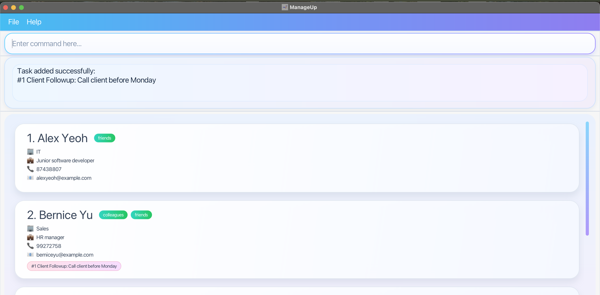
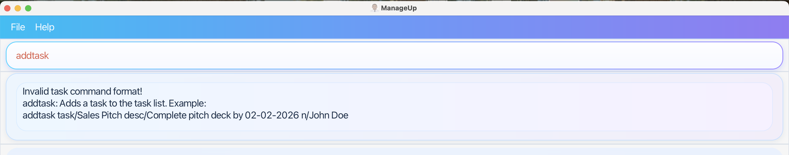
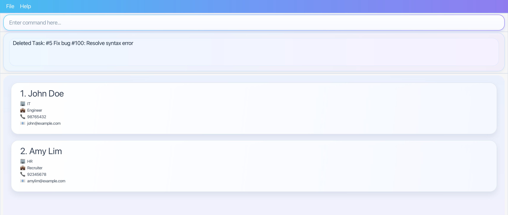
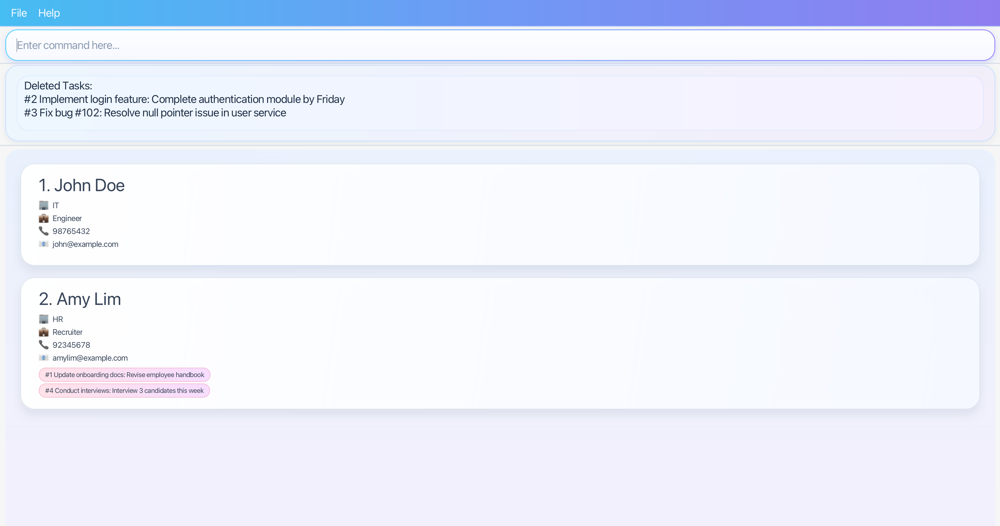
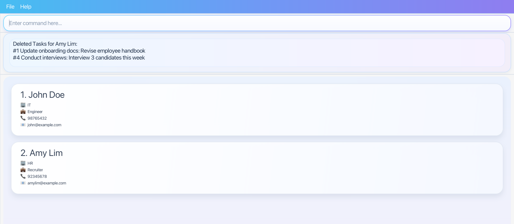

# ManageUp User Guide

Sick of spreadsheets, scattered documents and switching between multiple tools? 

ManageUp is an **employee and task management application** designed for **managers overseeing multiple teams or departments**. It is
optimised for use via a **Command Line Interface (CLI)**, while still providing the benefits of a
**Graphical User Interface (GUI)**. ManageUp offers a **centralised** and **streamlined** approach to managing employee
data, including contact details, positions, departments, and assigned tasks.

## Who is this guide for?

<box type="definition" seamless>

ManageUp is built for **managers overseeing multiple teams or departments** who:

* Prefer typing commands over navigating menus
* Need one place to track employee contact details, departments, positions, and tasks
* May work offline — ManageUp requires no internet connection

**Assumed knowledge:** Basic comfort with using CLI and Terminal (e.g. `cd`, `java -jar`).

</box>

**Key features:**
* Manage employee records — [`add`](#adding-an-employee-add), [`edit`](#editing-an-employee-edit), [`delete`](#deleting-an-employee-delete) employees and their details
* Filter employees by name, department, position, tag, or task — [`show`](#showing-filtered-employees-show)
* Assign and track tasks per employee — [`addtask`](#adding-a-task-addtask), [`edittask`](#editing-a-task-edittask), [`deletetask`](#deleting-a-task-deletetask), [`cleartasks`](#clearing-all-tasks-for-an-employee-cleartasks)
* Works fully offline — no internet connection required

New to ManageUp? Start with [Quick Start](#quick-start). Already installed? Jump to [Features](#features) or [Command Summary](#command-summary).

--------------------------------------------------------------------------------------------------------------------

<!-- * Table of Contents -->
<page-nav-print />

## Table of Contents

* [Quick start](#quick-start)
* [Features](#features)
  * Employee management
    * [Adding an employee: `add`](#adding-an-employee)
    * [Listing all employees: `list`](#listing-all-employees)
    * [Editing an employee: `edit`](#editing-an-employee)
    * [Deleting an employee: `delete`](#deleting-an-employee)
  * Task management
    * [Adding a task to an employee: `addtask`](#adding-a-task-to-an-employee)
    * [Editing a task: `edittask`](#editing-a-task)
    * [Deleting a task: `deletetask`](#deleting-a-task)
    * [Clearing all tasks for an employee: `cleartasks`](#clearing-all-tasks-for-an-employee)
  * General features
    * [Viewing help: `help`](#viewing-help)
    * [Showing filtered employees: `show`](#showing-filtered-employees)
    * [Clearing all entries: `clear`](#clearing-all-entries)
    * [Exiting the program: `exit`](#exiting-the-program)
  * Data management
    * [Saving the data](#saving-the-data)
    * [Editing the data file](#editing-the-data-file)
* [FAQ](#faq)
* [Known issues](#known-issues)
* [Command summary](#command-summary)
* [Troubleshooting](#troubleshooting)
  * [Troubleshooting `add`](#troubleshooting-add)
  * [Troubleshooting `edit`](#troubleshooting-edit)
  * [Troubleshooting `show`](#troubleshooting-show)
  * [Troubleshooting `delete`](#troubleshooting-delete)
  * [Troubleshooting `addtask`](#troubleshooting-addtask)
  * [Troubleshooting `edittask`](#troubleshooting-edittask)
  * [Troubleshooting `deletetask`](#troubleshooting-deletetask)
  * [Troubleshooting `cleartasks`](#troubleshooting-cleartasks)

--------------------------------------------------------------------------------------------------------------------

## Quick start

1. ManageUp requires **Java 17 or above**. You can check your Java version by running:

   ```
   java -version
   ```

   If the version shown is **17 or above**, skip to Step 2. Otherwise, install Java 17:

   | Operating System  | How to install                                                                                                           |
   |-------------------|--------------------------------------------------------------------------------------------------------------------------|
   | **Windows**       | Follow the installation guide [here](https://se-education.org/guides/tutorials/javaInstallationWindows.html).            |
   | **Mac**           | Install the **exact JDK version** prescribed [here](https://se-education.org/guides/tutorials/javaInstallationMac.html). |
   | **Linux**         | Follow the installation guide [here](https://se-education.org/guides/tutorials/javaInstallationLinux.html)               |

2. Download the latest `ManageUp.jar` from the ManageUp Github [releases page](https://github.com/AY2526S2-CS2103T-T14-1/tp/releases). 

3. Save the file to the folder you want to use as the _home folder_ for ManageUp.

4. Open Terminal or Command Prompt and navigate to the folder containing `ManageUp.jar` using `cd`, then launch the app with `java -jar ManageUp.jar`.

   For example, if you saved `ManageUp.jar` in your **Downloads** folder:

   | OS | Commands to run |
   |----|------------------|
   | **Windows** | `cd C:\Users\YOUR_USERNAME\Downloads` <br> `java -jar ManageUp.jar` |
   | **Mac / Linux** | `cd ~/Downloads` <br> `java -jar ManageUp.jar` |

   Replace `Downloads` with the name of your chosen folder if different.

5. ManageUp opens with sample data, as shown below. 

   

6. Type commands in the command box at the top and press **Enter** to execute them. Some commands to try:

   * `list` — lists all employees
   * `add n/John Doe p/98765432 e/johnd@example.com d/IT pos/Software Engineer` — adds an employee
   * `show d/IT` — filters employees in the IT department
   * `addtask 1 task/Prepare Report desc/Submit by Friday` — adds a task to employee at index 1
   * `exit` — exits the app

7. Refer to [Features](#features) for full details of each command, or [Command Summary](#command-summary) for a quick reference.

--------------------------------------------------------------------------------------------------------------------

## Features

<box type="info" seamless>

**Notes about the command format:**<br>

* Words in `UPPER_CASE` are the parameters to be supplied by the user.<br>
  e.g. in `add n/NAME`, `NAME` is a parameter which can be used as `add n/John Doe`.

* Items in square brackets are optional.<br>
  e.g `n/NAME [t/TAG]` can be used as `n/John Doe t/friend` or as `n/John Doe`.

* Items with `…`​ after them can be used multiple times including zero times.<br>
  e.g. `[t/TAG]…​` can be used as ` ` (i.e. 0 times), `t/friend`, `t/friend t/family` etc.

* All commands and parameters are case-sensitive. For example, `add` is a valid command but `ADD` is not. Similarly, `n/NAME` is valid but `N/NAME` is not.

* Parameters can be in any order unless specified.<br>
  e.g. if the command specifies `n/NAME p/PHONE_NUMBER`, `p/PHONE_NUMBER n/NAME` is also acceptable.

* If you type extra text after commands like `help`, `list`, `exit`, or `clear`, ManageUp will ignore it.<br>
  e.g. if the command specifies `help 123`, it will be interpreted as `help`.

* If you are using a PDF version of this document, be careful when copying and pasting commands that span multiple lines as space characters surrounding line-breaks may be omitted when copied over to the application.
</box>

<a id="email-format"></a>
<box type="info" seamless>

**Valid email format:**

An email must follow the format `local-part@domain` and adhere to these rules:
- The local-part may contain alphanumeric characters and `+`, `_`, `.`, `-`, but cannot start or end with these special characters.
- The domain must be at least 2 characters long.
- Each domain label must start and end with alphanumeric characters, and may only contain hyphens in between (e.g. `my-domain.com`).
- The total length must not exceed 100 characters.
- Emails are compared case-insensitively.

</box>

<a id="viewing-help"></a>
### Viewing help : `help`

Shows an in-app help window with supported commands, allowed inputs, and examples.

Format: `help`

#### Overview

When you enter `help`, ManageUp opens a separate help window inside the app.

The help window gives a quick summary of:

* supported commands
* the allowed input format for each command
* one or more examples you can follow directly

This is useful when you want a quick reminder without scrolling through the full User Guide.

#### Command usage

`help` does not require any additional parameters.

If you type extra text after `help`, ManageUp will still interpret it as `help`.

The help window displays a compact command reference and a button that copies the online User Guide URL to your
clipboard so you can open the full guide in a browser if needed.

After entering `help`, ManageUp opens the Help Window shown below.


#### Important notes

<box type="tip" seamless>

**Tip:** Use `help` when you forget a command format or want a quick example before trying a command.
</box>

* The help window is intended as a quick reference. The full User Guide still contains more detailed explanations and examples.


#### Examples

* `help`
  Opens the in-app Help Window.


<a id="adding-an-employee"></a>
### Adding an employee: `add`

Adds a new employee to ManageUp.

Format:
```
add n/NAME p/PHONE e/EMAIL d/DEPARTMENT pos/POSITION [t/TAG]...
```

* Only `TAG` is optional. All other parameters must be provided.
* Duplicate prefixes for `n/`, `p/`, `e/`, `d/`, and `pos/` are not allowed.

<box type="info" seamless>

**Note:** If you provide duplicate tags in the same command (e.g. `t/intern t/intern`), ManageUp will treat them as one — only a single tag will be saved.

</box>

<box type="info" seamless>

**Parameter constraints for this command:**

| Parameter | Length         | Allowed Characters                                                    |
|-----------|----------------|-----------------------------------------------------------------------|
| `NAME`    | 1–100 characters  | Alphanumeric characters, hyphens (`-`), apostrophes (`'`), and spaces |
| `PHONE`   | 3–15 digits    | Numbers only                                                          |
| `EMAIL`   | 1–100 characters  | Follows [valid email format](#email-format)                           |
| `DEPARTMENT` | 1–100 characters | Alphanumeric characters and spaces only                            |
| `POSITION`  | 1–100 characters | Alphanumeric characters and spaces only                             |
| `TAG`     | 1–50 characters   | Alphanumeric characters only                                          |

</box>


<box type="warning" seamless>

**Warning:** Duplicate employees are not allowed. An employee is considered a duplicate if they share the same name as an existing employee, and also share the same phone number or the same email address (or both). Any attempt to add a duplicate employee will be rejected.

</box>

<box type="warning" seamless>

**Warning:** Phone numbers must be unique across all employees. Adding a duplicate phone number will be rejected and will show which existing employee owns it.

</box>

<box type="warning" seamless>

**Warning:** Email addresses must be unique across all employees and are compared case-insensitively. Adding a duplicate email will be rejected and will show which existing employee owns it.

</box>

<box type="tip" seamless>

**Tip:** Use tags as flexible labels — e.g. `t/onLeave`, `t/MC`, `t/probation`, `t/mentor`. An employee can have any number of tags (including none).

</box>


#### Examples

* `add n/John Doe p/98765432 e/johnd@example.com d/IT pos/Software Engineer` – adds an employee with no tags.
* `add n/Betsy Crowe p/91234567 e/betsycrowe@example.com d/HR pos/Recruiter t/fulltime` – adds an employee with one tag.
* `add n/Jacob Smith p/87763456 e/jacob@example.com d/Finance pos/Marketer t/intern t/partTime` – adds an employee with multiple tags.

After entering a valid `add` command, ManageUp confirms the new employee was added. The new employee appears at the bottom of the full employee list.

<box type="info" seamless>

**Expected output:**


</box>

#### Errors
Facing errors? See [Troubleshooting `add`](#troubleshooting-add).

### Listing all employees : `list`

Shows a list of all employees in the address book.

Format: `list`

### Showing filtered employees: `show`

Shows employees that match one or more field-based filters.

**Format:**  
`show [n/NAME_KEYWORD...] [d/DEPARTMENT_KEYWORD...] [p/PHONE_KEYWORD...] [e/EMAIL_KEYWORD...] [pos/POSITION_KEYWORD...] [t/TAG_KEYWORD...] [task/TASK_KEYWORD...]`

##### How it works

The `show` command filters the employee list using the prefixes you provide.

A prefix refers to a field of an employee:
- `n/` for name
- `d/` for department
- `p/` for phone
- `e/` for email
- `pos/` for position
- `t/` for tag
- `task/` for task

You must provide **at least one** filter. If no filter is given, the command is invalid.

##### Matching behaviour

`show` uses **case-insensitive substring matching** for all supported fields.

This means:
- matching is **not case-sensitive**
- partial keywords are allowed
- a match is found as long as the keyword appears anywhere inside the field value

For example:
- `n/al` can match `Alex`, `Sally`, or `ALAN`
- `d/it` can match `IT`
- `e/gmail` can match `alex@gmail.com`
- `pos/engineer` can match `Software Engineer`
- `t/mentor` can match a tag such as `mentor`
- `task/report` can match a task such as `Prepare report`

##### Different prefixes: AND behaviour

When you provide **different prefixes**, they are combined using **AND**.

This means an employee must satisfy **all** of those filters to be shown.

For example:
- `show n/Alex d/IT` shows only employees whose name contains `Alex` **and** whose department contains `IT`
- `show d/HR pos/Manager` shows only employees whose department contains `HR` **and** whose position contains `Manager`
- `show t/fulltime task/report` shows only employees who have a tag containing `fulltime` **and** a task containing `report`

So the more different fields you add, the narrower the result becomes.

##### Multiple keywords under the same prefix: OR behaviour

When a single prefix is followed by **multiple keywords**, those keywords are treated as **OR** within that field.

This means an employee only needs to match **one** of those keywords for that field.

For example:
- `show n/John Alex` shows employees whose name contains `John` **or** `Alex`
- `show d/HR Finance` shows employees whose department contains `HR` **or** `Finance`
- `show t/mentor fulltime` shows employees who have a tag containing `mentor` **or** `fulltime`

If this is combined with other prefixes, the OR logic applies within that field, while different fields are still combined using AND.

For example:
- `show n/John Alex d/IT` shows employees whose name contains `John` **or** `Alex`, **and** whose department contains `IT`
- `show t/mentor fulltime task/report` shows employees who have a tag containing `mentor` **or** `fulltime`, **and** a task containing `report`

##### Order of filters

Filters can be written in **any order**.

For example, the following commands are treated the same:
- `show n/Alex d/IT`
- `show d/IT n/Alex`

##### Supported keyword format

Each prefix can be followed by **one or more keywords**.

Each keyword is matched separately using substring matching.

For example:
- `show n/John Alex` checks whether the employee’s name contains `John` or `Alex`
- `show pos/Engineer Manager` checks whether the employee’s position contains `Engineer` or `Manager`

Since matching is based on substrings, shorter keywords are often enough.

For example:
- `show pos/Engineer` may already match `Software Engineer`
- `show d/Fin` may match `Finance`
- `show task/report` may match `Prepare report`
- `show t/lead` may match `teamlead`

##### Notes
- At least one filter must be provided.
- Filters are case-insensitive.
- All matching is based on substring containment.
- Different prefixes are combined using **AND**.
- Multiple keywords under the same prefix are treated as **OR**.
- Filters can be written in any order.

#### Examples

- `show e/gmail`  
  Shows employees whose email contains `gmail`.

- `show pos/Engineer`  
  Shows employees whose position contains `Engineer`, such as `Software Engineer`.

- `show t/mentor`  
  Shows employees with a tag containing `mentor`.

- `show task/report`  
  Shows employees with a task containing `report`.

- `show n/John Alex`  
  Shows employees whose name contains `John` **or** `Alex`.

- `show d/HR Finance`  
  Shows employees whose department contains `HR` **or** `Finance`.

- `show t/mentor fulltime`  
  Shows employees with a tag containing `mentor` **or** `fulltime`.

- `show n/Alex pos/Manager`  
  Shows employees whose name contains `Alex` **and** whose position contains `Manager`.

- `show pos/Manager d/HR`  
  Shows employees whose position contains `Manager` **and** whose department contains `HR`.

- `show n/John Alex d/IT`  
  Shows employees whose name contains `John` **or** `Alex`, and whose department contains `IT`.

- `show t/intern task/report`  
  Shows employees with a tag containing `intern` **and** a task containing `report`.

<a id="editing-an-employee"></a>
### Editing an employee: `edit`

Edits the details of an existing employee identified by the employee index. Only fields you include are changed.

Format:
```
edit INDEX [n/NAME] [p/PHONE] [e/EMAIL] [d/DEPARTMENT] [pos/POSITION] [t/TAG]...
```

* `INDEX` refers to the employee index shown in the currently displayed employee list.
* At least one of the optional fields must be provided.
* Duplicate prefixes for `n/`, `p/`, `e/`, `d/`, and `pos/` are not allowed.

<box type="info" seamless>

**Note:** If you provide duplicate tags in the same command (e.g. `t/intern t/intern`), ManageUp will treat them as one — only a single tag will be saved.

</box>

<box type="info" seamless>

**Parameter constraints for this command:**

| Parameter    | Length           | Allowed Characters                                                    |
|--------------|------------------|-----------------------------------------------------------------------|
| `INDEX`       | – | Positive integer that exists in the current employee list             |
| `NAME`       | 1–100 characters | Alphanumeric characters, hyphens (`-`), apostrophes (`'`), and spaces |
| `PHONE`      | 3–15 digits      | Numbers only                                                          |
| `EMAIL`      | 1–100 characters | Follows [valid email format](#email-format)                           |
| `DEPARTMENT` | 1–100 characters | Alphanumeric characters and spaces only                               |
| `POSITION`   | 1–100 characters | Alphanumeric characters and spaces only                               |
| `TAG`        | 1–50 characters  | Alphanumeric characters only                                          |

</box>

<box type="warning" seamless>

**Warning:** When editing tags, **all** existing tags are **replaced** by the newly provided ones.

</box>

<box type="warning" seamless>

**Warning:** Editing an employee to have the same name and the same phone number or email address as an existing employee is not allowed and will be rejected. 

</box>

<box type="warning" seamless>

**Warning:** Phone numbers must be unique across all employees. Editing an employee's phone number to one already belonging to another employee will be rejected.

</box>

<box type="warning" seamless>

**Warning:** Email addresses must be unique across all employees and are compared case-insensitively. Editing an employee's email to one already belonging to another employee will be rejected.

</box>

<box type="tip" seamless>

**Tip:** `edit` uses the index from the **currently displayed list**. If you have filtered the list with `show`, use the indexes shown in the filtered list.

</box>

<box type="tip" seamless>

**Tip:** To remove all tags from an employee, use `t/` without any value after it.
</box>


#### Examples

* `edit 1 p/91234567 e/johndoe@example.com` – edits the phone number and email of the 1st employee.
* `edit 2 pos/Team Lead` – edits the position of the 2nd employee.
* `edit 3 n/Betsy Crower t/` – edits the name of the 3rd employee and clears all existing tags.
* `edit 4 d/Finance t/likesCats t/golfs` – edits the department of the 4th employee and replaces all existing tags.

After a successful `edit` command, ManageUp confirms the update and shows the **full** employee list.

<box type="info" seamless>

**Expected output:**


</box>

#### Errors
Facing errors? See [Troubleshooting `edit`](#troubleshooting-edit).

<a id="deleting-an-employee"></a>
### Deleting an employee : `delete`

Deletes one or more specified employees from the address book.

Format: `delete NAME` or `delete INDEX [MORE_INDEXES]...`

#### Overview

The `delete` command supports two ways to remove employees:

* by `NAME`
* by one or more displayed `INDEX` values

Both forms operate on the **currently displayed employee list**.

This means the result depends on what is currently shown in the app window. For example, after a `show` command, the indexes
refer to the filtered list instead of the full list.

#### Command usage

##### Deleting by name

Use `delete NAME` when you want to remove an employee by name instead of list position.

* Name matching is **case-insensitive**.
* Extra spaces in the input are ignored.
* The entered name must match **one unique employee** in the currently displayed list.

For example, after entering `delete betsy Crowe`, ManageUp deletes the matching employee and shows a success message.


##### Deleting by index

Use `delete INDEX` when you want to remove one displayed employee by position in the current list.

* The index refers to the number shown in the currently displayed employee list.
* The index **must be a positive integer** such as `1`, `2`, or `3`.
* Index-based deletion is useful when multiple employees have similar or identical names.

For example, after entering `delete 2`, ManageUp deletes the 2nd displayed employee and shows a success message.


##### Batch deletion

You can delete several employees in one command by listing multiple indexes.

* Example format: `delete 1 3 5`
* Every index must be valid before ManageUp deletes any employee.
* The order of the indexes does not matter. For example, `delete 13 5 10` and `delete 5 10 13` are both valid as long as all the indexes exist in the currently displayed list.
* Duplicate indexes in the same command are not allowed. For example, `delete 1 2 2` is not valid because index `2` is duplicated.

This prevents partial deletion when one of the indexes is wrong.

For example, after entering `delete 1 2 3`, ManageUp deletes all three displayed employees and lists them in the success message.


#### Important notes

<box type="tip" seamless>

**Tip:** If you want to delete from the full employee list again after using `show`, run `list` first so the indexes are
reset to the full list.
</box>

* `delete NAME` checks only the employees currently shown on screen.
* `delete INDEX` and batch delete also use the currently displayed list.
* If an invalid index is provided, no employee will be deleted.
* If no employee matches the given name, the command will fail.
* If the entered name contains invalid characters, the command will fail.

For example, entering `delete 100` fails because the provided index is invalid.


For example, entering `delete max` fails because no displayed employee matches that name.


For example, entering `delete 1b#` fails because the name contains invalid characters.


<box type="warning" seamless>

**Warning:** If more than one displayed employee has the same name, `delete NAME` will fail. In that case, use
`delete INDEX` instead.
</box>

For example, entering `delete john doe` fails because multiple displayed employees have the same name.


#### Examples

* `list` followed by `delete 2`
  Deletes the 2nd employee in the full employee list.

* `show d/HR` followed by `delete 1`
  Deletes the 1st employee in the filtered employee list.

* `list` followed by `delete 1 3 5`
  Deletes the 1st, 3rd, and 5th employees in the displayed employee list.

* `delete John Doe`
  Deletes the employee named `John Doe` if exactly one displayed employee matches that name.

<a id="adding-a-task-to-an-employee"></a>
### Adding a task to an employee : `addtask`

Adds a task to a specific employee.

Format: `addtask EMPLOYEE_INDEX task/TASK_NAME desc/TASK_DESCRIPTION`

* `EMPLOYEE_INDEX` refers to the employee index shown in the currently displayed employee list.
* The task will be added to that employee's personal task list and shown on the employee card.
* The task will have an index number attached to it, to indicate task number.
* A task name between 1 and 40 characters and a task description between 1 and 120 characters must be provided.
* Only 1 `task/` and 1 `desc/` are allowed in the command. Duplicate prefixes are not allowed.
* The format and order of `task/` and `desc/` should be followed exactly as stated in the format and no field should be left out.
* `addtask` provides a warning message to the user with the specified format to remind users of the correct format if the command is invalid.
* `addtask 1 task/Prepare Report` is not valid because the description field is missing.

Examples:
* `addtask 2 task/Prepare Report desc/Submit by Friday` 
   adds a task named `Prepare Report` with description `Submit by Friday` to employee at index 2.
* `addtask 2 task/Client Followup desc/Call client before Monday` 
   adds a task named `Client Followup` with description `Call client before Monday` to employee at index 2.

  
* `addtask`
   shows the warning message with the correct format for `addtask` because the command is invalid.
  
* `addtask 1 task/TASK_NAME_MORE_THAN_40_CHARACTERS desc/Submit by Friday`
   shows the warning message because the task name exceeds the character limit.
  
* `addtask 1 task/Prepare Report desc/TASK_DESCRIPTION_MORE_THAN_120_CHARACTERS`
   shows the warning message because the task description exceeds the character limit.
  
* `addtask INVLAID_EMPLOYEE_INDEX task/Prepare Report desc/Submit by Friday`
   shows the warning message because the employee index is invalid.
  

<a id="editing-a-task"></a>
### Editing a task: `edittask`

Edits the name and/or description of an existing task identified by its task index.

Format:
```
edittask TASK_INDEX [task/TASK_NAME] [desc/TASK_DESCRIPTION]
```

* `TASK_INDEX` refers to the task index shown beside the task on the employee card (e.g. `#1`, `#2`).
* At least one of `task/` or `desc/` must be provided.
* Fields not provided remain unchanged.
* Duplicate prefixes are not allowed (e.g. two `task/` in one command).

<box type="info" seamless>

**Note:** You can edit any task using its `TASK_INDEX` index, even if the employee it belongs to is not currently shown on screen. For example, if you have used `show` to filter the list, tasks belonging to hidden employees can still be edited using their task index.

</box>

<box type="info" seamless>

**Parameter constraints for this command:**

| Parameter          | Length                                                | Allowed Characters                                    |
|--------------------|-------------------------------------------------------|-------------------------------------------------------|
| `TASK_INDEX`       | – | Positive integer that exists in the current task list |
| `TASK_NAME`        | 1–40 characters                                       | Any characters                                        |
| `TASK_DESCRIPTION` | 1–120 characters                                      | Any characters                                        |

</box>


#### Examples

* `edittask 1 task/Prepare Report desc/Submit by Friday` – edits both the name and description of task `#1`.
* `edittask 2 task/Client Followup` – edits only the name of task `#2`.
* `edittask 3 desc/Submit by Friday` – edits only the description of task `#3`.

After entering a valid `edittask` command, ManageUp confirms the update and shows the edited task.

<box type="info" seamless>

**Expected output:**


</box>

#### Errors
Facing errors? See [Troubleshooting `edittask`](#troubleshooting-edittask).

<a id="deleting-a-task"></a>
### Deleting a task : `deletetask`

Deletes one or more tasks using their displayed task indices.

Format: `deletetask INDEX [MORE_INDICES]...`

* `INDEX` refers to the task index shown beside the task on the employee card, for example `#1`.
* Each index **must be a positive integer** 1, 2, 3, …​
* You can provide multiple task indices in one command to batch delete tasks.
* When multiple task indices are provided, every task index must be valid before any task is deleted.
* Duplicate task indices in the same command are not allowed.
* `deletetask` removes the task from both the employee's personal task list and the overall task list used internally by ManageUp.
* If an invalid task index is provided, ManageUp will reject the command and no task will be deleted.
* `deletetask` provides a warning message to the user with the specified format to remind users of the correct format if the command is invalid.

Examples:
* `deletetask 1` deletes the task with task index `1`.



* `deletetask 2 4` deletes the tasks with task indices `2` and `4`.



* `deletetask 0` is not valid because task indices must start from `1`.

<a id="clearing-all-tasks-for-an-employee"></a>
### Clearing all tasks for an employee : `cleartasks`

Clears every task assigned to one employee.

Format: `cleartasks INDEX` or `cleartasks n/EMPLOYEE_NAME`

* `INDEX` refers to the employee index shown in the currently displayed employee list.
* `n/EMPLOYEE_NAME` clears tasks for the uniquely matching employee name in the currently displayed employee list.
* `cleartasks` removes all tasks from both the employee's personal task list and the overall task list used internally by ManageUp.
* If the employee index is invalid, no tasks will be cleared.
* If the provided employee name does not match any displayed employee, the command will fail.
* If more than one displayed employee has the same name, the command will fail and you should use `cleartasks INDEX` instead.

Examples:
* `cleartasks 1` clears all tasks assigned to the 1st displayed employee.
* `cleartasks n/John Doe` clears all tasks assigned to employee `John Doe`.



* `cleartasks 0` is not valid because employee indices must start from `1`.

<a id="clearing-all-entries"></a>
### Clearing all entries : `clear`

Clears all entries from the address book.

Format: `clear`

<a id="exiting-the-program"></a>
### Exiting the program : `exit`

Exits the program.

Format: `exit`

<a id="saving-the-data"></a>
### Saving the data

ManageUp data are saved in the hard disk automatically after any command that changes the data.
There is no need to save manually.

<a id="editing-the-data-file"></a>
### Editing the data file

ManageUp data are saved automatically as a JSON file `[JAR file location]/data/addressbook.json`.
Advanced users are welcome to update data directly by editing that data file.

**Caution:**
If your changes to the data file makes its format invalid, ManageUp will discard all data and start with an empty data file at the next run. Hence, it is recommended to take a backup of the file before editing it.<br>
Furthermore, certain edits can cause ManageUp to behave in unexpected ways (e.g., if a value entered is outside the acceptable range). Therefore, edit the data file only if you are confident that you can update it correctly.

### More features `[coming in v2.0]`

_More features coming soon ..._

--------------------------------------------------------------------------------------------------------------------

## FAQ

**Q**: How do I transfer my data to another Computer?<br>
**A**: Install the app on the other computer and overwrite the empty data file it creates with the file that contains the data of your previous ManageUp home folder.

--------------------------------------------------------------------------------------------------------------------

## Known issues

1. **When using multiple screens**, if you move the application to a secondary screen, and later switch to using only the primary screen, the GUI will open off-screen. The remedy is to delete the `preferences.json` file created by the application before running the application again.
2. **If you minimize the Help Window** and then run the `help` command (or use the `Help` menu, or the keyboard shortcut `F1`) again, the original Help Window will remain minimized, and no new Help Window will appear. The remedy is to manually restore the minimized Help Window.

--------------------------------------------------------------------------------------------------------------------

## Command summary

| Action                                | Command         | Format                                                                                                                                                             |
|---------------------------------------|-----------------|--------------------------------------------------------------------------------------------------------------------------------------------------------------------|
| Add an employee to contacts           | **Add**         | `add n/NAME p/PHONE e/EMAIL d/DEPARTMENT pos/POSITION [t/TAG]...`<br> e.g., `add n/James Ho p/22224444 e/jamesho@example.com d/Finance pos/Analyst t/fulltime`     |
| Delete an employee from contacts      | **Delete**      | `delete NAME` or `delete INDEX [MORE_INDEXES]...`<br> e.g., `delete James Ho`, `delete 3`, `delete 1 3 5`                                                          |
| Edit an employee's details            | **Edit**        | `edit INDEX [n/NAME] [p/PHONE] [e/EMAIL] [d/DEPARTMENT] [pos/POSITION] [t/TAG]...`<br> e.g., `edit 2 n/James Lee e/jameslee@example.com`                           |
| List all employees in contacts        | **List**        | `list`                                                                                                                                                             |
| Show filtered employees from contacts | **Show**        | `show [n/NAME] [d/DEPARTMENT] [p/PHONE] [e/EMAIL] [pos/POSITION] [t/TAG] [task/TASK]...` <br> e.g., `show n/Ja d/Finance pos/Developer HR Management t/Nightshift` |
| Delete ALL employees from contacts    | **Clear**       | `clear`                                                                                                                                                            |
| Add tasks to an employee              | **Add Task**    | `addtask EMPLOYEE_INDEX task/TASK_NAME desc/TASK_DESCRIPTION`<br> e.g., `addtask 1 task/Prepare Slides desc/Send by Friday`                                        |
| Edit a task                           | **Edit Task**   | `edittask TASK_INDEX [task/TASK_NAME] [desc/TASK_DESCRIPTION]`<br> e.g., `edittask 6 task/Close deal desc/Finalise by Wednesday`                                    |
| Delete a task                         | **Delete Task** | `deletetask TASK_INDEX`<br> e.g., `deletetask 1`                                                                                                                   |
| Clear all tasks for one employee      | **Clear Tasks** | `cleartasks INDEX` or `cleartasks n/EMPLOYEE_NAME`<br> e.g., `cleartasks 1`, `cleartasks n/James Ho`                                                               |
| Display help message                  | **Help**        | `help`                                                                                                                                                             |


## Troubleshooting

If a command you entered did not produce the expected result and ManageUp displayed an error message, come to this section. Each subsection covers one command — find your scenario in the **Scenario** column, and follow the **How to fix** column to resolve it.


<div style="height: 10px;"></div>

<a id="troubleshooting-add"></a>

### Troubleshooting `add`

Use this section when `add` fails.

| Scenario | Message shown | How to fix                                                                                                               |
|----------|---------------|--------------------------------------------------------------------------------------------------------------------------|
| Missing required fields or wrong syntax | `Invalid command format. Please use the following format: ...` | Use the format: `add n/NAME p/PHONE e/EMAIL d/DEPARTMENT pos/POSITION [t/TAG]...`                                        |
| Name contains invalid characters or is too long | `Names should only contain alphanumeric characters, spaces, hyphens or apostrophes, and it should not be blank or exceed 100 characters` | Use only letters, digits, spaces, `-` or `'` — name must start with a letter or digit and be at most 100 characters long |
| Phone contains non-digits or wrong length | `Phone numbers should only contain numbers, and it should be 3 to 15 digits long` | Use digits only, between 3 and 15 digits long                                                                            |
| Email format is invalid | `Emails should be of the format local-part@domain and adhere to the following constraints: ...` | Re-enter a valid email, e.g. `johnd@example.com` (see [valid email format](#email-format))                               |
| Department contains invalid characters or is too long | `Department should only contain alphanumeric characters and spaces, and it should not be blank or exceed 100 characters` | Use only letters, digits, and spaces — at most 100 characters long                                                       |
| Position contains invalid characters or is too long | `Positions should only contain alphanumeric characters and spaces, and it should not be blank or exceed 100 characters` | Use only letters, digits, and spaces — at most 100 characters long                                                       |
| Tag contains invalid characters, is empty, or is too long | `Tag names should be alphanumeric and between 1 and 50 characters long` | Use only letters and digits (no spaces or special characters) — between 1 and 50 characters long |
| Same prefix used more than once | `Multiple values were provided for these fields, but each field accepts only one value: [field(s)]` | Remove the extra prefix — each of `n/`, `p/`, `e/`, `d/`, `pos/` may only appear once                                    |
| Employee with same name and phone or email already exists | `This employee already exists in ManageUp.` | Change the name, phone number, or email to differ from any existing employee                                             |
| Phone number already belongs to another employee | `This phone number is already assigned to another employee: ...` | Use a phone number not already assigned to another employee                                                              |
| Email already belongs to another employee | `This email address is already assigned to another employee: ...` | Use an email address not already assigned to another employee                                                            |

<div style="height: 20px;"></div>

<a id="troubleshooting-edit"></a>

### Troubleshooting `edit`

Use this section when `edit` fails.

| Scenario | Message shown | How to fix                                                                                                               |
|----------|---------------|--------------------------------------------------------------------------------------------------------------------------|
| Index is missing or non-numeric | `Invalid command format. Please use the following format: ...` | Use the format: `edit INDEX [n/NAME] [p/PHONE] [e/EMAIL] [d/DEPARTMENT] [pos/POSITION] [t/TAG]...`                       |
| Index is out of range | `Invalid employee index. Please enter an index shown in the current employee list.` | Run `list` to see valid indexes and use one from the displayed list                                                      |
| No fields provided to update | `Please provide at least one employee field to update.` | Include at least one of `n/`, `p/`, `e/`, `d/`, `pos/`, or `t/`                                                          |
| Edited details match an existing employee | `This employee already exists in ManageUp.` | Change the name, phone number, or email to differ from any existing employee                                             |
| New phone number already belongs to another employee | `This phone number is already assigned to another employee: ...` | Use a phone number not already assigned to another employee                                                              |
| New email already belongs to another employee | `This email address is already assigned to another employee: ...` | Use an email address not already assigned to another employee                                                            |
| Same prefix used more than once | `Multiple values were provided for these fields, but each field accepts only one value: [field(s)]` | Remove the extra prefix — each of `n/`, `p/`, `e/`, `d/`, `pos/` may only appear once                                    |
| Name contains invalid characters or is too long | `Names should only contain alphanumeric characters, spaces, hyphens or apostrophes, and it should not be blank or exceed 100 characters` | Use only letters, digits, spaces, `-` or `'` — name must start with a letter or digit and be at most 100 characters long |
| Phone contains non-digits or wrong length | `Phone numbers should only contain numbers, and it should be 3 to 15 digits long` | Use digits only, between 3 and 15 digits long                                                                            |
| Email format is invalid | `Emails should be of the format local-part@domain and adhere to the following constraints: ...` | Re-enter a valid email, e.g. `johnd@example.com` (see [valid email format](#email-format))                               |
| Department contains invalid characters or is too long | `Department should only contain alphanumeric characters and spaces, and it should not be blank or exceed 100 characters` | Use only letters, digits, and spaces — at most 100 characters long                                                       |
| Position contains invalid characters or is too long | `Positions should only contain alphanumeric characters and spaces, and it should not be blank or exceed 100 characters` | Use only letters, digits, and spaces — at most 100 characters long                                                       |
| Tag contains invalid characters or is too long | `Tag names should be alphanumeric and between 1 and 50 characters long` | Use only letters and digits (no spaces or special characters) — between 1 and 50 characters long |

<div style="height: 20px;"></div>

<a id="troubleshooting-show"></a>

### Troubleshooting `show`

Use this section when `show` fails.

| Scenario | Message shown | How to fix |
|----------|---------------|------------|
| No filters provided | `Invalid command format. Please use the following format: ...` | Use the format: `show [n/NAME] [d/DEPARTMENT] [p/PHONE] [e/EMAIL] [pos/POSITION] [t/TAG] [task/TASK]...` — include at least one prefix filter |
| A prefix is provided but its value is blank | `[Field] field should not be empty.` (e.g. `Name field should not be empty.`) | Add a keyword after the prefix, e.g. `show n/John` instead of `show n/` |

<div style="height: 20px;"></div>

<a id="troubleshooting-delete"></a>

### Troubleshooting `delete`

Use this section when `delete` fails.

| Scenario | Message shown | How to fix |
|----------|---------------|------------|
| Index provided is out of range | `Invalid employee index. Please enter an index shown in the current employee list.` | Run `list` to see valid indexes and use one from the displayed list |
| No employee matches the given name | `No employee named '[name]' was found in the current list.` | Check the spelling and run `list` to confirm the employee exists |
| More than one employee matches the given name | `More than one employee named '[name]' was found. Please use the employee index instead.` | Use `delete INDEX` to delete by number instead of name |
| Name contains invalid characters | `Invalid employee name. Names should only contain alphanumeric characters, spaces, hyphens or apostrophes, and it should not be blank or exceed 100 characters` | Use only letters, digits, spaces, `-` or `'` in the name |
| Same index given more than once in batch delete | `Duplicate employee indices are not allowed.` | Each index may appear only once per command |

<div style="height: 20px;"></div>

<a id="troubleshooting-addtask"></a>

### Troubleshooting `addtask`

Use this section when `addtask` fails.

| Scenario | Message shown | How to fix |
|----------|---------------|------------|
| Missing fields or wrong syntax | `Invalid task command format. Please use the following format: ...` | Use the format: `addtask EMPLOYEE_INDEX task/TASK_NAME desc/TASK_DESCRIPTION` |
| Task name is blank or too long | `Task name should not be empty and should be between 1 and 40 characters.` | Re-enter a task name between 1 and 40 characters long |
| Task description is blank or too long | `Task description should not be empty and should be between 1 and 120 characters.` | Re-enter a task description between 1 and 120 characters long |
| Employee index is out of range | `Invalid employee index. Please enter an index shown in the current employee list.` | Run `list` and use a valid employee index |
| Task with same name and description already exists for this employee | `This employee already has a task with the same name and same description.` | Change the task name or description |

<div style="height: 20px;"></div>

<a id="troubleshooting-edittask"></a>

### Troubleshooting `edittask`

Use this section when `edittask` fails.

| Scenario | Message shown | How to fix |
|----------|---------------|------------|
| Task index is missing or non-numeric | `Invalid command format. Please use the following format: ...` | Use the format: `edittask TASK_INDEX [task/TASK_NAME] [desc/TASK_DESCRIPTION]` |
| No fields provided to update | `Please provide at least one task field to update.` | Include at least one of `task/TASK_NAME` or `desc/TASK_DESCRIPTION` |
| `task/` used more than once | `Multiple values were provided for these fields, but each field accepts only one value: task/` | Remove the extra `task/` — it may only appear once per command |
| `desc/` used more than once | `Multiple values were provided for these fields, but each field accepts only one value: desc/` | Remove the extra `desc/` — it may only appear once per command |
| Task name is blank or too long | `Task name should not be empty and should be between 1 and 40 characters.` | Re-enter a task name between 1 and 40 characters long |
| Task description is blank or too long | `Task description should not be empty and should be between 1 and 120 characters.` | Re-enter a task description between 1 and 120 characters long |
| Task index is 0, negative, or does not exist | `Invalid task index. Please enter a task index that is currently shown in ManageUp.` | Enter a positive integer matching a task index shown as `#N` on an employee card |

<div style="height: 20px;"></div>

<a id="troubleshooting-deletetask"></a>

### Troubleshooting `deletetask`

Use this section when `deletetask` fails.

| Scenario | Message shown | How to fix |
|----------|---------------|------------|
| No index provided or wrong syntax | `Invalid command format. Please use the following format: ...` | Use the format: `deletetask TASK_INDEX [MORE_INDICES]...` — provide at least one task index |
| Index is 0 or negative | `Invalid task index. Please enter only positive task indices.` | Task indexes start from 1 — check the `#N` shown on the employee card |
| Index does not match any existing task | `Invalid task index. Please enter task indices that are currently shown in ManageUp.` | Check the `#N` numbers on employee cards to find valid indexes |
| Same index given more than once | `Duplicate task indices are not allowed.` | Each task index may appear only once per command |

<div style="height: 20px;"></div>

<a id="troubleshooting-cleartasks"></a>

### Troubleshooting `cleartasks`

Use this section when `cleartasks` fails.

| Scenario | Message shown | How to fix |
|----------|---------------|------------|
| Index provided is out of range | `Invalid employee index. Please enter an index shown in the current employee list.` | Run `list` and use a valid employee index |
| No employee matches the given name | `No employee named '[name]' was found in the current list.` | Check the spelling and run `list` to confirm the employee exists |
| More than one employee matches the given name | `More than one employee named '[name]' was found. Please use the employee index instead.` | Use `cleartasks INDEX` to clear by number instead of name |
| Name contains invalid characters | `Invalid employee name. Names should only contain alphanumeric characters, spaces, hyphens or apostrophes, and it should not be blank or exceed 100 characters` | Use only letters, digits, spaces, `-` or `'` in the name |
