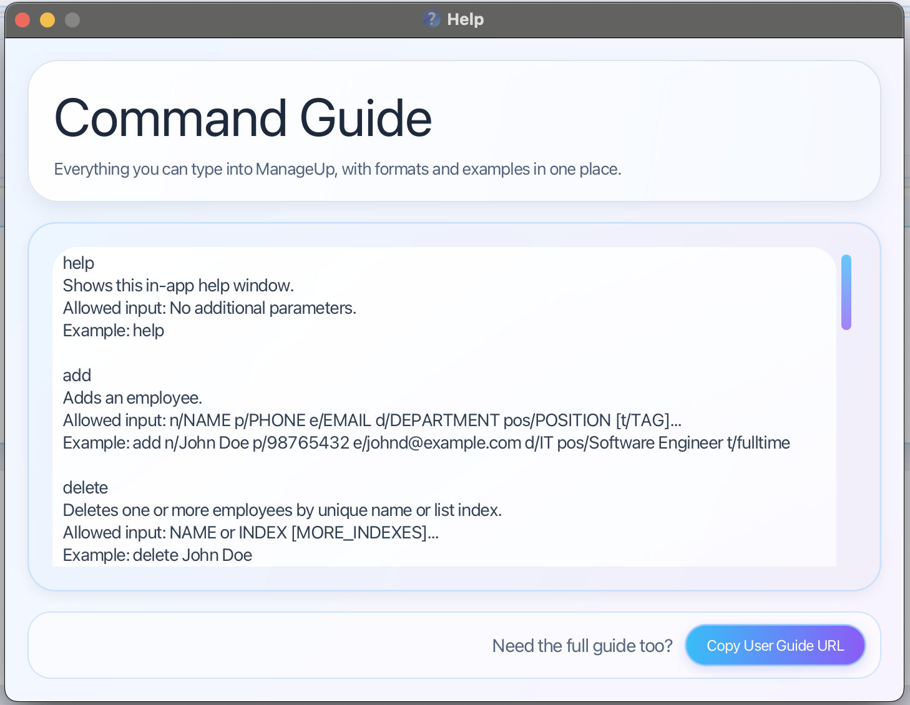

# ManageUp User Guide

ManageUp is a **desktop app for managers to manage employee records, optimized for use via a Command Line Interface**
(CLI) while still providing the benefits of a Graphical User Interface (GUI). It helps managers manage various teams, 
tracking employee contact details, roles, departments, and assign tasks more efficiently.

<!-- * Table of Contents -->
<page-nav-print />

## Contents

* [Quick start](#quick-start)
* [Features](#features)
  * Employee management
    * [Adding an employee: `add`](#adding-an-employee)
    * [Listing all employees: `list`](#listing-all-employees)
    * [Editing an employee: `edit`](#editing-an-employee)
    * [Deleting an employee: `delete`](#deleting-an-employee)
  * Task management
    * [Adding a task to an employee: `addtask`](#adding-a-task-to-an-employee)
    * [Editing a task: `edittask`](#editing-a-task)
    * [Deleting a task: `deletetask`](#deleting-a-task)
  * General features
    * [Viewing help: `help`](#viewing-help)
    * [Showing filtered employees: `show`](#showing-filtered-employees)
    * [Clearing all entries: `clear`](#clearing-all-entries)
    * [Exiting the program: `exit`](#exiting-the-program)
  * Data management
    * [Saving the data](#saving-the-data)
    * [Editing the data file](#editing-the-data-file)
* [FAQ](#faq)
* [Known issues](#known-issues)
* [Command summary](#command-summary)

--------------------------------------------------------------------------------------------------------------------

## Quick start

1. Ensure you have Java `17` or above installed in your Computer. 
   **Mac users:** Ensure you have the precise JDK version prescribed [here](https://se-education.org/guides/tutorials/javaInstallationMac.html).

1. Download the latest `.jar` file from the ManageUp GitHub releases page.

1. Copy the file to the folder you want to use as the _home folder_ for ManageUp.

1. Open Terminal or Command Prompt, go to the folder where you saved the jar file
   (for example, by using `cd` to change folders), and run `java -jar ManageUp.jar`. 
   A window similar to the one below should appear in a few seconds. Note how the app contains some sample data. 
   

1. Type the command in the command box and press Enter to execute it. e.g. typing **`help`** and pressing Enter will open the help window. 
   Some example commands you can try:

   * `list` : Lists all employees.

   * `add n/John Doe p/98765432 e/johnd@example.com d/IT pos/Software Engineer` : Adds an employee named `John Doe`.

   * `delete John Doe` : Deletes the employee named `John Doe` if the name is unique in the current list.

   * `delete 1 3 5` : Deletes the 1st, 3rd, and 5th employees in the currently displayed list.

   * `addtask task/Prepare Report desc/Submit by Friday n/John Doe` : Adds a task to employee `John Doe`.

   * `deletetask 1 3` : Deletes the tasks with task indices `1` and `3`.

   * `show d/IT` : Shows employees whose department contains `IT`.

   * `clear` : Deletes all employees.

   * `exit` : Exits the app.

1. Refer to the [Features](#features) below for details of each command.

--------------------------------------------------------------------------------------------------------------------

## Features

<box type="info" seamless>

**Notes about the command format:** 

* Words in `UPPER_CASE` are the parameters to be supplied by the user. 
  e.g. in `add n/NAME`, `NAME` is a parameter which can be used as `add n/John Doe`.

* Items in square brackets are optional. 
  e.g `n/NAME [t/TAG]` can be used as `n/John Doe t/friend` or as `n/John Doe`.

* Items with `…`​ after them can be used multiple times including zero times. 
  e.g. `[t/TAG]…​` can be used as ` ` (i.e. 0 times), `t/friend`, `t/friend t/family` etc.

* Parameters can be in any order. 
  e.g. if the command specifies `n/NAME p/PHONE_NUMBER`, `p/PHONE_NUMBER n/NAME` is also acceptable.

* If you type extra text after commands like `help`, `list`, `exit`, or `clear`, ManageUp will ignore it. 
  e.g. if the command specifies `help 123`, it will be interpreted as `help`.

* If you are using a PDF version of this document, be careful when copying and pasting commands that span multiple lines as space characters surrounding line-breaks may be omitted when copied over to the application.
</box>

### Viewing help : `help`

Shows an in-app help window with supported commands, allowed inputs, and examples.
The help window also includes a button to copy the online user guide URL if you want
to open the full guide in a browser.

Format: `help`

### Adding an employee: `add`

Adds an employee to the address book.

Format: `add n/NAME p/PHONE e/EMAIL d/DEPARTMENT pos/POSITION [t/TAG]...`

<box type="tip" seamless>

**Tip:** An employee can have any number of tags (including 0).
</box>

* Phone numbers must contain only digits and be at least 3 digits long.
* Names, departments, and positions must be non-empty and use only alphanumeric characters and spaces.
* Emails must be valid email addresses.
* Phone numbers and email addresses must be unique across employees.

Examples:
* `add n/John Doe p/98765432 e/johnd@example.com d/IT pos/Software Engineer`
* `add n/Betsy Crowe p/91234567 e/betsycrowe@example.com d/HR pos/Recruiter t/fulltime`
* `add n/Jacob Smith p/87763456 e/jacob@example.com d/Finance pos/Marketer t/intern t/partTime`

### Listing all employees : `list`

Shows a list of all employees in the address book.

Format: `list`

### Showing filtered employees: `show`

Shows employees that match one or more field-based filters.

**Format:**  
`show [n/NAME_KEYWORD...] [d/DEPARTMENT_KEYWORD...] [p/PHONE_KEYWORD...] [e/EMAIL_KEYWORD...] [pos/POSITION_KEYWORD...] [t/TAG_KEYWORD...] [task/TASK_KEYWORD...]`

#### How it works

The `show` command filters the employee list using the prefixes you provide.

A prefix refers to a field of an employee:
- `n/` for name
- `d/` for department
- `p/` for phone
- `e/` for email
- `pos/` for position
- `t/` for tag
- `task/` for task

You must provide **at least one** filter. If no filter is given, the command is invalid.

#### Matching behaviour

`show` uses **case-insensitive substring matching** for all supported fields.

This means:
- matching is **not case-sensitive**
- partial keywords are allowed
- a match is found as long as the keyword appears anywhere inside the field value

For example:
- `n/al` can match `Alex`, `Sally`, or `ALAN`
- `d/it` can match `IT`
- `e/gmail` can match `alex@gmail.com`
- `pos/engineer` can match `Software Engineer`
- `t/mentor` can match a tag such as `mentor`
- `task/report` can match a task such as `Prepare report`

#### Different prefixes: AND behaviour

When you provide **different prefixes**, they are combined using **AND**.

This means an employee must satisfy **all** of those filters to be shown.

For example:
- `show n/Alex d/IT` shows only employees whose name contains `Alex` **and** whose department contains `IT`
- `show d/HR pos/Manager` shows only employees whose department contains `HR` **and** whose position contains `Manager`
- `show t/fulltime task/report` shows only employees who have a tag containing `fulltime` **and** a task containing `report`

So the more different fields you add, the narrower the result becomes.

#### Multiple keywords under the same prefix: OR behaviour

When a single prefix is followed by **multiple keywords**, those keywords are treated as **OR** within that field.

This means an employee only needs to match **one** of those keywords for that field.

For example:
- `show n/John Alex` shows employees whose name contains `John` **or** `Alex`
- `show d/HR Finance` shows employees whose department contains `HR` **or** `Finance`
- `show t/mentor fulltime` shows employees who have a tag containing `mentor` **or** `fulltime`

If this is combined with other prefixes, the OR logic applies within that field, while different fields are still combined using AND.

For example:
- `show n/John Alex d/IT` shows employees whose name contains `John` **or** `Alex`, **and** whose department contains `IT`
- `show t/mentor fulltime task/report` shows employees who have a tag containing `mentor` **or** `fulltime`, **and** a task containing `report`

#### Order of filters

Filters can be written in **any order**.

For example, the following commands are treated the same:
- `show n/Alex d/IT`
- `show d/IT n/Alex`

#### Supported keyword format

Each prefix can be followed by **one or more keywords**.

Each keyword is matched separately using substring matching.

For example:
- `show n/John Alex` checks whether the employee’s name contains `John` or `Alex`
- `show pos/Engineer Manager` checks whether the employee’s position contains `Engineer` or `Manager`

Since matching is based on substrings, shorter keywords are often enough.

For example:
- `show pos/Engineer` may already match `Software Engineer`
- `show d/Fin` may match `Finance`
- `show task/report` may match `Prepare report`
- `show t/lead` may match `teamlead`

#### Notes
- At least one filter must be provided.
- Filters are case-insensitive.
- All matching is based on substring containment.
- Different prefixes are combined using **AND**.
- Multiple keywords under the same prefix are treated as **OR**.
- Filters can be written in any order.

#### Examples

- `show d/IT`  
  Shows employees whose department contains `IT`.

- `show n/Alex`  
  Shows employees whose name contains `Alex`.

- `show n/Al`  
  Shows employees whose names contain `Al`, such as `Alex`, `Alice`, or `Sally`.

- `show e/gmail`  
  Shows employees whose email contains `gmail`.

- `show pos/Engineer`  
  Shows employees whose position contains `Engineer`, such as `Software Engineer`.

- `show t/mentor`  
  Shows employees with a tag containing `mentor`.

- `show task/report`  
  Shows employees with a task containing `report`.

- `show n/John Alex`  
  Shows employees whose name contains `John` **or** `Alex`.

- `show d/HR Finance`  
  Shows employees whose department contains `HR` **or** `Finance`.

- `show t/mentor fulltime`  
  Shows employees with a tag containing `mentor` **or** `fulltime`.

- `show n/Alex pos/Manager`  
  Shows employees whose name contains `Alex` **and** whose position contains `Manager`.

- `show pos/Manager d/HR`  
  Shows employees whose position contains `Manager` **and** whose department contains `HR`.

- `show n/John Alex d/IT`  
  Shows employees whose name contains `John` **or** `Alex`, and whose department contains `IT`.

- `show t/intern task/report`  
  Shows employees with a tag containing `intern` **and** a task containing `report`.

### Editing an employee : `edit` 
Edits an existing employee in the address book.

Format: `edit INDEX [n/NAME] [p/PHONE] [e/EMAIL] [d/DEPARTMENT] [pos/POSITION] [t/TAG]...`

* Edits the employee at the specified `INDEX`.
* The index refers to the index number shown in the displayed employee list.
* The index **must be a positive integer** 1, 2, 3, …​
* At least one of the optional fields must be provided.
* Existing values will be updated to the input values.
* When editing tags, the existing tags of the employee will be removed; adding of tags is not cumulative.
* You can remove all the employee's tags by typing `t/` without
    specifying any tags after it.
* After a successful edit, ManageUp returns to showing the full employee list.

Examples:
* `edit 1 p/91234567 e/johndoe@example.com` edits the phone number and email of the 1st employee.
* `edit 2 pos/Team Lead` edits the position of the 2nd employee.
* `edit 3 n/Betsy Crower t/` edits the name of the 3rd employee and clears all existing tags.
* `edit 4 d/Finance t/likesCats t/golfs` edits the department of the 4th employee and replaces all existing tags. 

### Deleting an employee : `delete`

Deletes one or more specified employees from the address book.

Format: `delete NAME` or `delete INDEX [MORE_INDEXES]...`

* `delete INDEX` deletes the employee at the specified `INDEX`.
* The index refers to the index number shown in the displayed employee list.
* The index **must be a positive integer** 1, 2, 3, …​
* You can provide multiple indexes in one command to batch delete employees.
* When multiple indexes are provided, every index must be valid before any employee is deleted.
* Duplicate indexes in the same command are not allowed.
* `delete NAME` deletes the employee whose name matches `NAME`, ignoring case and extra spaces.
* `delete NAME` works only when exactly one employee matches the given name.
* If multiple employees share the same name, use `delete INDEX` instead.

Examples:
* `list` followed by `delete 2` deletes the 2nd employee in the address book.
* `show d/HR` followed by `delete 1` deletes the 1st employee in the filtered employee list.
* `list` followed by `delete 1 3 5` deletes the 1st, 3rd, and 5th employees in the displayed employee list.
* `delete John Doe` deletes the employee named `John Doe` if the name is unique in the current list.

### Adding a task to an employee : `addtask`

Adds a task to a specific employee.

Format: `addtask task/TASK_NAME desc/TASK_DESCRIPTION n/EMPLOYEE_NAME`

* `EMPLOYEE_NAME` refers to the name of the employee to whom the task will be added.
* `EMPLOYEE_NAME` must match an existing employee name exactly as stored in ManageUp and is case-sensitive.
* The task will be added to that employee's personal task list and shown on the employee card.
* The task will have an index number attached to it, to indicate task number.
* The format and order of tags should be followed exactly as stated and no field should be left out.
* `addtask` provides a warning message to the user with the specified format to remind users of the correct format if the command is invalid.
* `addtask task/Prepare Report n/John Doe` is not valid because the description field is missing.

Examples:
* `addtask task/Prepare Report desc/Submit by Friday n/John Doe` 
   adds a task named `Prepare Report` with description `Submit by Friday` to employee `John Doe`.
* `addtask task/Client Followup desc/Call client before Monday n/Amy Bee` 
   adds a task named `Client Followup` with description `Call client before Monday` to employee `Amy Bee`.

### Editing a task: `edittask`

Edits the name and/or description of an existing task identified by its task index.

Format:  `edittask TASK_INDEX [task/TASK_NAME] [desc/TASK_DESCRIPTION]`

* `TASK_INDEX` refers to the task index shown beside the task on the employee card, for example `#1`.
* At least one of the optional fields (`task/` or `desc/`) must be provided.
* Fields not specified will remain unchanged.
* Duplicate prefixes are not allowed (e.g. multiple `task/`).

Examples:
* `edittask 1 task/Prepare Report desc/Submit by Friday` edits both the task name and task description
* `edittask 2 task/Client Followup` edits only the task name
* `edittask 3 desc/Submit by Friday` edits only the task description

### Deleting a task : `deletetask`

Deletes one or more tasks using their displayed task indices.

Format: `deletetask INDEX [MORE_INDICES]...`

* `TASK_INDEX` refers to the task index shown beside the task on the employee card, for example `#1`.
* The index **must be a positive integer** 1, 2, 3, …
* You can provide multiple task indices in one command to batch delete tasks.
* Deleting a task removes it from both the employee's task list and the overall task list used internally by the app.

Examples:
* `deletetask 1`
* `deletetask 1 3 5`

### Clearing all entries : `clear`

Clears all entries from the address book.

Format: `clear`

### Exiting the program : `exit`

Exits the program.

Format: `exit`

### Saving the data

ManageUp data are saved in the hard disk automatically after any command that changes the data.
There is no need to save manually.

### Editing the data file

ManageUp data are saved automatically as a JSON file `[JAR file location]/data/addressbook.json`.
Advanced users are welcome to update data directly by editing that data file.

**Caution:**
If your changes to the data file makes its format invalid, ManageUp will discard all data and start with an empty data file at the next run. Hence, it is recommended to take a backup of the file before editing it. 
Furthermore, certain edits can cause ManageUp to behave in unexpected ways (e.g., if a value entered is outside the acceptable range). Therefore, edit the data file only if you are confident that you can update it correctly.
</box>

### More features `[coming in v2.0]`

_More features coming soon ..._

--------------------------------------------------------------------------------------------------------------------

## FAQ

**Q**: How do I transfer my data to another Computer? 
**A**: Install the app on the other computer and overwrite the empty data file it creates with the file that contains the data of your previous ManageUp home folder.

--------------------------------------------------------------------------------------------------------------------

## Known issues

1. **When using multiple screens**, if you move the application to a secondary screen, and later switch to using only the primary screen, the GUI will open off-screen. The remedy is to delete the `preferences.json` file created by the application before running the application again.
2. **If you minimize the Help Window** and then run the `help` command (or use the `Help` menu, or the keyboard shortcut `F1`) again, the original Help Window will remain minimized, and no new Help Window will appear. The remedy is to manually restore the minimized Help Window.

--------------------------------------------------------------------------------------------------------------------

## Command summary

| Action                                | Command         | Format                                                                                                                                                             |
|---------------------------------------|-----------------|--------------------------------------------------------------------------------------------------------------------------------------------------------------------|
| Add an employee to contacts           | **Add**         | `add n/NAME p/PHONE e/EMAIL d/DEPARTMENT pos/POSITION [t/TAG]...`  e.g., `add n/James Ho p/22224444 e/jamesho@example.com d/Finance pos/Analyst t/fulltime`     |
| Delete an employee from contacts      | **Delete**      | `delete NAME` or `delete INDEX [MORE_INDEXES]...`  e.g., `delete James Ho`, `delete 3`, `delete 1 3 5`                                                          |
| Edit an employee's details            | **Edit**        | `edit INDEX [n/NAME] [p/PHONE] [e/EMAIL] [d/DEPARTMENT] [pos/POSITION] [t/TAG]...`  e.g., `edit 2 n/James Lee e/jameslee@example.com`                           |
| List all employees in contacts        | **List**        | `list`                                                                                                                                                             |
| Show filtered employees from contacts | **Show**        | `show [n/NAME] [d/DEPARTMENT] [p/PHONE] [e/EMAIL] [pos/POSITION] [t/TAG] [task/TASK]...`   e.g., `show n/Ja d/Finance pos/Develepor HR Management t/Nightshift` |
| Delete ALL employees from contacts    | **Clear**       | `clear`                                                                                                                                                            |
| Add tasks to an employee              | **Add Task**    | `addtask task/TASK_NAME desc/TASK_DESCRIPTION n/EMPLOYEE_NAME`  e.g., `addtask task/Prepare Slides desc/Send by Friday n/James Ho`                              |
| Edit a task                           | **Edit Task**   | `edittask TASK_INDEX task/TASK_NAME desc/TASK_DESCRIPTION `  e.g., `edittask 6 task/Close deal desc/Finalise by Wednesday `                                     |
| Delete a task                         | **Delete Task** | `deletetask TASK_INDEX`  e.g., `deletetask 1`                                                                                                                   |
| Display help message                  | **Help**        | `help`                                                                                                                                                             |
